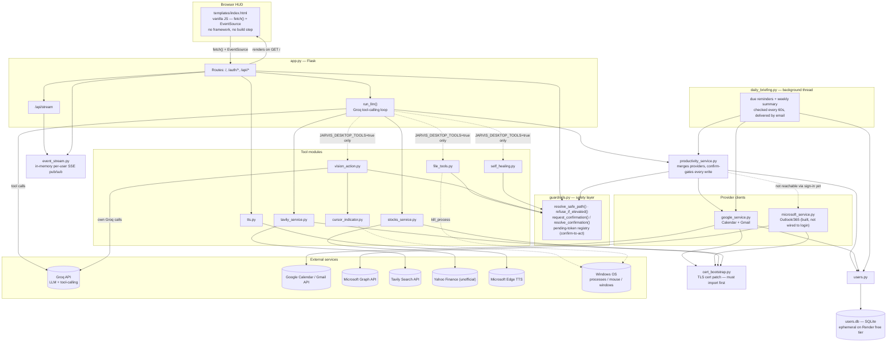

# J.A.R.V.I.S — System Architecture

Generated from the actual import graph of this deployment (the cloud/multi-tenant
fork at `האפליקציה הסופית` — `JARVIS_DESKTOP_TOOLS=false` in `render.yaml`, so the
desktop-control tools shown below are wired into the code but not exposed to the
LLM in production). Dashed edges are conditional or not yet wired in.

## Notes on what the diagram is actually saying

- **`templates/index.html` never talks to any Python module directly** — every
  interaction goes through `app.py`'s HTTP routes or its one SSE endpoint. There's
  no server-side templating (`render_template("index.html")` is called with zero
  context vars); all state lives in the browser's JS.
- **`guardrails.py` has no internal imports of its own** — it's the dependency
  sink every other module (except `event_stream.py` and `users.py`) reaches into,
  never the other way around. That's deliberate (see its own docstring): one
  audited module is easier to trust than scattered checks.
- **`event_stream.py` is only reachable from `app.py`** — `productivity_service.py`
  returns plain dicts (`status`/`token`/`kind`/`details`); `app.py` is what decides
  to push those over SSE. `daily_briefing.py` deliberately does **not** use SSE at
  all (a background thread can't assume a browser tab is open) — it emails
  directly through `google_service.send_email` instead.
- **`microsoft_service.py` is a dead branch in this build** — fully implemented
  and imported by `productivity_service.py`, but this fork's sign-in flow is
  Google-only, so it's never actually reached today.
- **Desktop-control tools are present but gated** — `file_tools.py` (beyond its
  sandboxed workspace functions), `vision_action.py`, and `self_healing.py` are
  unconditionally imported, but `app.py`'s `ACTIVE_TOOLS` only exposes them to the
  LLM when `JARVIS_DESKTOP_TOOLS=true`. `render.yaml` sets it `false` for this
  cloud deployment, since there's no Windows desktop on the other end of a Render
  dyno to control.
- **`cert_bootstrap.py` isn't part of the data flow** — it's a side-effect-only
  import (patches `certifi`/`SSL_CERT_FILE` for the process) that every module
  making its own HTTPS calls (`google_service`, `microsoft_service`,
  `tavily_service`, `stocks_service`) imports first, per this repo's `CLAUDE.md`.
